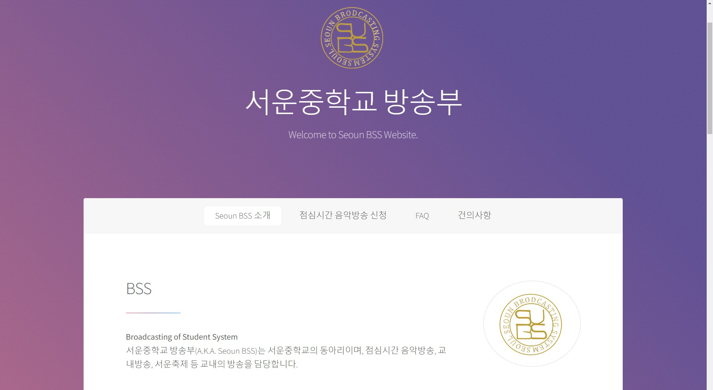
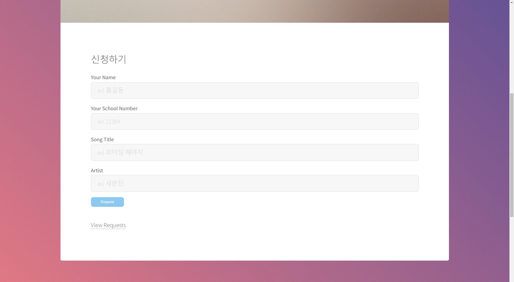
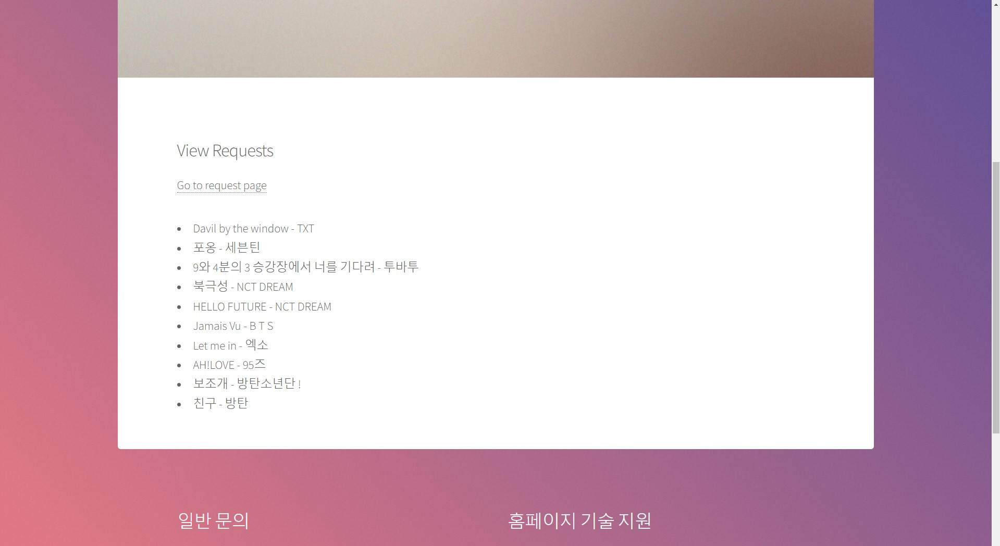
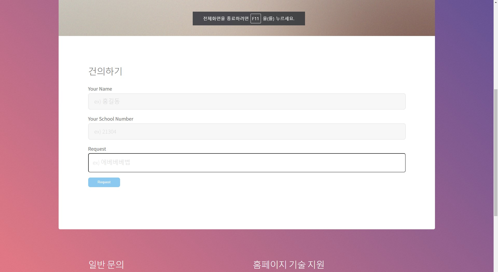

<!-- Explanation -->
# 서운중학교 방송부 웹사이트

이 저장소는 서운중학교 방송부의 웹사이트에 대한 소스 코드와 리소스 파일을 포함합니다. 이 웹사이트는 서운중학교 학생들과 교내 커뮤니티를 위한 정보와 서비스를 제공합니다.

## 홈페이지 화면
Main Page

/songrequest

/see-songrequest

/request

## 기능

- **Seoun BSS 소개**: 서운중학교 방송부에 대한 소개와 역할을 설명합니다.
- **점심시간 음악방송 신청**: 학생들이 점심시간에 방송에서 틀어주길 원하는 노래를 신청할 수 있습니다.
- **FAQ**: 자주 묻는 질문과 그에 대한 답변을 제공합니다.
- **건의사항**: 학생들이 방송부에 건의할 내용을 제출할 수 있는 페이지입니다.

## 기여

이 웹사이트는 서운중학교 방송부 멤버에 의해 유지되고 관리됩니다.

## 저작권 정보

이 웹사이트의 디자인은 HTML5 UP에서 제공한 "Stellar" 템플릿을 사용하여 만들어졌습니다. 자세한 정보는 [HTML5 UP](https://
html5up.net)을 참조하세요.

서운중학교 방송부에 속한 콘텐츠 및 로고에 대한 모든 저작권은 서운중학교 방송부에 속합니다. 이 저장소의 코드 및 리소스 파일은 개인 및 상업적인 목적으로 사용할 수 있으며, [CCA 3.0 라이선스](html5up.net/license)에 따라 제공됩니다.

자세한 내용은 아래의 <!-- Sorces -->를 참고하세요.

## 문의 사항

웹사이트에 관련된 일반 문의 사항은 다음을 참조하세요:

- 학교 방송부: 서울특별시 서초구 서운로 115, [학교이메일]
- 홈페이지 기술 지원: 홈페이지 담당자 (Email: [gangguhyeon1113@gmail.com](mailto:gangguhyeon1113@gmail.com), Instagram: [@kgh_guhyeon](https://www.instagram.com/kgh_guhyeon))

© 1982~2023 서운중학교 방송부. 모든 권리 보유.

<!-- Sorces -->
Stellar by HTML5 UP
html5up.net | @ajlkn
Free for personal and commercial use under the CCA 3.0 license (html5up.net/license)

Say hello to Stellar, a slick little one-pager with a super vibrant color palette (which
I guess you can always tone down if it's a little too vibrant for you), a "sticky" in-page
nav bar (powered by my Scrollex plugin), a separate generic page template (just in case
you need one), and an assortment of pre-styled elements.

Demo images* courtesy of Unsplash, a radtastic collection of CC0 (public domain) images
you can use for pretty much whatever.

(* = not included)

AJ
aj@lkn.io | @ajlkn

Credits:

	Demo Images:
		Unsplash (unsplash.com)

	Icons:
		Font Awesome (fontawesome.io)

	Other:
		jQuery (jquery.com)
		Scrollex (github.com/ajlkn/jquery.scrollex)
		Responsive Tools (github.com/ajlkn/responsive-tools)
